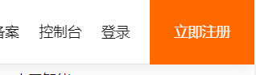
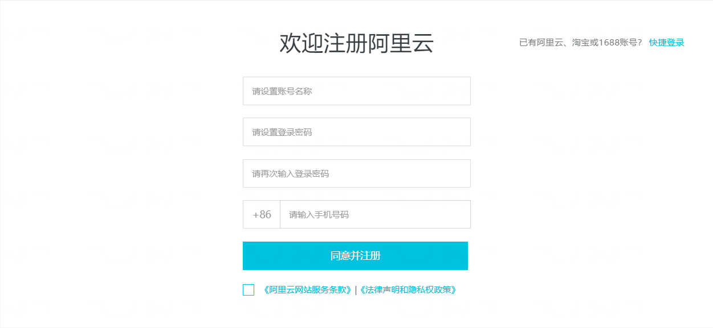
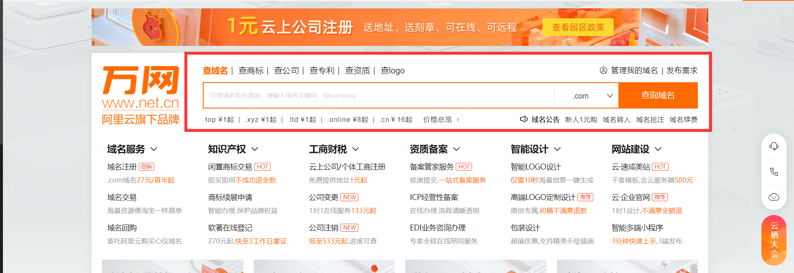
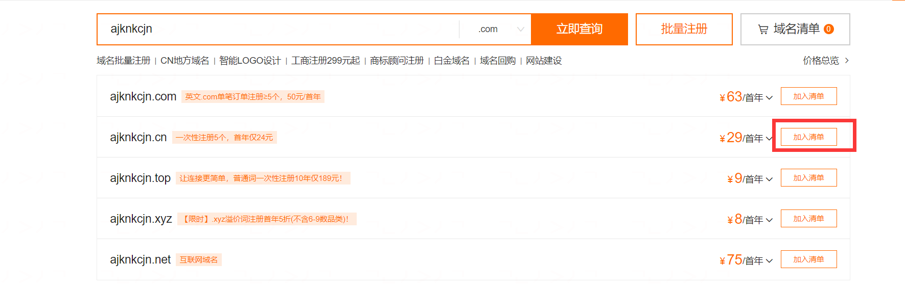
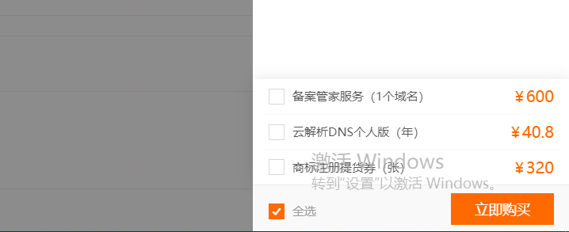
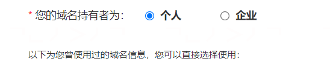

# 第一天

## Abstract
1. 注册阿里云账号
2. 进行个人实名认证
3. 进入域名注册界面
4. 挑选并买一个自己的域名
5. 进入 ICP 备案界面，将刚刚买的域名进行备案

## 注册阿里云账号
进入[阿里云官网](https://www.aliyun.com/)，点击右上角的**立即注册**

根据提示填入相应的资料

## 进行个人实名认证
进入个人账号中心中的实名认证，根据提示进行实名认证

## 进入域名注册界面
进入[阿里云域名注册界面](https://wanwang.aliyun.com/)

## 挑选并买一个自己的域名
在红框中搜索自己喜欢的域名

选好自己的域名，点击加入清单后，点击页面上的域名清单，进入结算页

不用勾选附加服务，点击立即购买

域名持有者选择个人，创建新的信息模板，按照提示进行操作

点击立即购买

### 进入 ICP 备案界面，将刚刚买的域名进行备案
进入[阿里云备案网站](https://beian.aliyun.com/)

选择继续备案

选择自主备案

填写备案主题和备案网站

